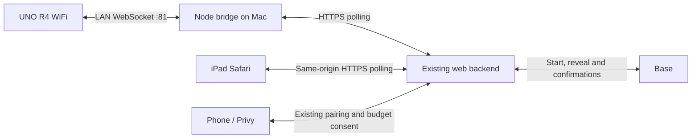

# Physical arcade: UNO R4 WiFi

This component owns the firmware and local hardware bridge. The iPad owns game
eligibility, animation and audio; the backend/contract still owns real games.
No wallet credential, signer or transaction is present on the Arduino or bridge.

## Connection



The Mac (or another always-on Node 22 host) must stay awake and reach both Arduino
and the app. The iPad and Arduino may share Wi-Fi, but Safari cannot open insecure
`ws://` from an HTTPS app. The bridge keeps that connection local and makes only
outbound HTTPS requests. No port forwarding, mixed-content override, extra keeper,
or additional database is required. The existing **single always-on app replica**
is still mandatory. This version deliberately requires the bridge; Arduino does
not yet connect directly to a public WSS endpoint.

## Wiring retained from the bench

| Component | Connection / behavior |
| --- | --- |
| Joystick | X A0, Y A1, center 512 on explicit 10-bit ADC; >300 deflection, center <120 rearms, 400 ms debounce |
| HC-SR501 PIR | OUT A3; on >620, off <200; 40 s warmup, 3 s rearm |
| LCD | I2C 0x27, 16×2, SDA/SCL; reconnect probing every second |
| WS2812 strip | 8 LEDs, D9 through existing 330 Ω resistor, GRB / 800 kHz, brightness 140 |
| Audio | iPad only; **no speaker on D9**, which drives the LEDs |

Keep existing power and common-ground wiring. The PIR detects **motion**, not
range or continuous presence. A person standing still may not trigger it again.
Do not infer wins from symbol artwork: URBE effects are only sent for a confirmed
winning URBE payout, not any occurrence of its symbol.

## Firmware

Install Arduino CLI, then the tested versions (the installed core used here is
1.5.1). This repository does not patch vendored library sources. The `compat/WiFi.h`
shim and compiler define select WiFiS3 in mWebSockets.

```sh
arduino-cli core install arduino:renesas_uno@1.5.1
arduino-cli lib install 'mWebSockets@1.6.0' 'ArduinoJson@7.4.2' \
  'Adafruit NeoPixel@1.15.1' 'LiquidCrystal I2C@1.1.2'
# Save SECRET_SSID / SECRET_PASS privately in arduino/.env.wifi, then:
node --env-file=arduino/.env.wifi arduino/configure-wifi.mjs
node arduino/build.mjs
arduino-cli board list
node arduino/build.mjs --upload /dev/cu.usbmodemYOUR_BOARD
arduino-cli monitor -p /dev/cu.usbmodemYOUR_BOARD -c baudrate=115200
```

`ARDUINO_CONFIG_FILE` optionally selects a separate CLI configuration/library
folder. Firmware and compiled binaries contain the Wi-Fi credentials: keep the
generated header and `artifacts/` private. No fallback AP is created, because
switching to it would lose backend connectivity. The LCD/serial show the LAN IP;
reserve that address in the router or update `ARDUINO_WS_URL` when DHCP changes.
Serial `l` simulates a lever, `m` motion, `s` prints non-secret status.

Wi-Fi association is bounded to 2.5 seconds, retried every 20 seconds; the watchdog
recovers a stalled loop. Motion never replaces spin/result text. The app renews
commands while a round is pending, so there is no fixed 2400 ms spin timeout.
After five seconds without application commands the firmware returns to idle,
without manufacturing a result. A reconnect restores current app state. Only one
WebSocket controller is accepted. Use a trusted cabinet LAN: the local WebSocket
itself is unencrypted and unauthenticated; do not expose port 81 to the internet.

## Bridge and iPad pairing

1. Generate a random secret of at least 32 characters and securely set the same
   `SLOT_HARDWARE_TOKEN` in the app environment and `arduino/bridge/.env`. It is
   server-only. Setting production variables/deploying requires separate approval.
2. Copy `arduino/bridge/.env.example` to `.env` in that folder. Set `APP_ORIGIN`
   to the same app origin the iPad uses and `ARDUINO_WS_URL` to the board LAN IP.
3. Run `npm ci --prefix arduino/bridge`, then `cd arduino/bridge && npm start`.
4. On the iPad, select **Hardware** and enter the bridge's eight-digit code
   (valid five minutes). Pairing is single-use and replaces the prior kiosk.
5. Tap **Attiva audio** or **Tocca per iniziare** on the iPad once. Safari requires
   a real touch to unlock audio; the PIR cannot supply browser user activation.

Only the bound browser receives input and controls the cabinet. Binding uses an
HttpOnly, SameSite cookie independent from the player session, so it survives
player changes and demo reloads. A backend restart requires pairing again. Hardware
requests never extend the three-minute player inactivity timer. Accepted spins
still use the existing relay's activity and transaction deduplication.

The bridge polls every 200 ms and the visible tablet every 300 ms, plus network
latency; this is suitable for cabinet input, not sample-accurate audio sync. Events
are bounded, expire rapidly, and are never retried after an uncertain upload. Each
eligible turn has a gate consumed once. Busy, stale, disconnected, hidden-tab and
previous-turn pulls are dropped, not queued. No extra spin is sent on reconnect.
The bridge refuses a second live bridge process; backend polling loss clears the
gate, and missing tablet heartbeats return idle lighting.

## Real and demo behavior

The root page defaults to **REALE**. **Passa a demo** reloads `/?demo=1`; **torna al
reale** reloads `/`. Switching is blocked while submission or reveal is pending.
The demo is an explicit browser-only simulator. It makes **no `/api/relay` calls**,
requires no login/wallet, and cannot send a transaction. Hardware transport remains
available. A real session left behind expires by the existing inactivity rule;
returning to real mode verifies it again through the normal backend.

- Idle shows the themed screensaver with the screen on. Motion or touch reveals
  the login QR (or simulated login in demo) for 45 seconds. Active sessions are
  never interrupted by motion. Logout/three-minute expiry restores the screensaver.
- In real mode, phone login and budget consent remain mandatory. The physical
  lever uses free spins first, then an eligible paid spin. The ticket price is
  read from the contract (configure **50,000 USDC base units = $0.05** onchain if
  desired); this change does not alter a deployed contract's price. Gas is extra
  and verified by the existing transaction path, not guessed by the Arduino.
- Reels and spin audio start on submission, continue through the first transaction,
  block wait and reveal, then stop only at the confirmed result. On an ambiguous
  submission/network failure the app reconciles rather than blindly resubmitting.
- Confirmed results drive tier-specific lights, iPad jingles and 16-character LCD
  text. Polling the same result does not replay its jingle. Recovering a historical
  result after reload displays it without celebrating again.
- Demo starts with two free spins and 25 simulated cents. A paid test uses five
  cents plus **one illustrative cent of gas**, not a gas quote. Select loss,
  3/4 matching symbols, jackpot, URBE or two bonus spins; the default cycles all.
  **Esaurisci crediti** verifies ignored inputs, **Ripristina demo** starts fresh.
  All credits and prizes are simulated and disappear on reload.

On iOS 12, disable Auto-Lock in Settings and keep Safari/the installed web app in
foreground (Guided Access is useful for a staffed cabinet). This target has no
reliable web Screen Wake Lock API. After screen lock/backgrounding Safari may
suspend audio: tap **Attiva audio** again if needed.

## Validation

```sh
npm --prefix apps/web test
npm --prefix apps/web run test:browser
npm --prefix apps/web run build
node arduino/build.mjs
```

Browser tests cover demo isolation, duplicate pulls, losses/wins, paid test credits,
expiry, 1024×768/650 layouts, and real hardware relay pairing/motion/lever with a
simulated device. Unit tests cover authentication, origin checks, one-use binding,
replayed/stale/busy inputs and heartbeat expiry. Final physical acceptance requires
the actual iPad audio unlock, PIR warmup, joystick centering, LCD and RGB strip.

Protocol: board → `{ "evt": "motion" | "lever" | "hello" | "pong" }`;
bridge → `{ "cmd": "idle" | "attract" | "ready" | "blocked" | "spin" | "result",
"l1": "...", "l2": "...", "tier": 0, "hub": false }`. `ping` is heartbeat only.
The bridge never sends wallet addresses, balances, transaction hashes or secrets
to the board.

References: [MDN WebSocket security](https://developer.mozilla.org/en-US/docs/Web/API/WebSockets_API/Writing_WebSocket_client_applications),
[WebKit iOS media activation](https://webkit.org/blog/6784/new-video-policies-for-ios/),
[design report](https://www.lazyweb.com/report/lazyweb/11e6b944-df59-4d1a-82a3-5580737e1681/?source=create).
