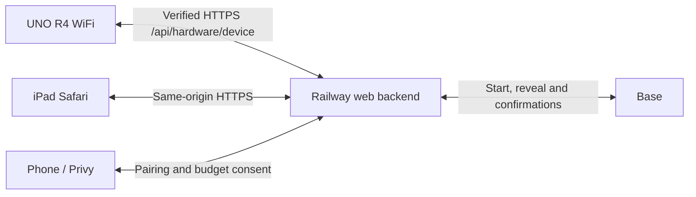

# Physical arcade: direct Railway connection

The UNO R4 WiFi connects directly to the existing Railway backend over verified
HTTPS. **No Mac, Node bridge, ngrok tunnel or local server is needed in production.**
The iPad owns eligibility, visuals and audio; the backend/contract owns real games.
Arduino holds only Wi-Fi credentials and a dedicated hardware token, never a wallet
key, Privy token or transaction signer.

## Connection



Arduino and iPad need internet access; they do not need the same LAN. Arduino
uses `WiFiSSLClient`, the radio firmware's trusted CA bundle and the public DNS
hostname on port 443. TLS errors fail closed: there is no insecure HTTP fallback,
certificate bypass, redirect following or inbound listener. Keep the radio firmware
and its CA bundle current through Arduino's official firmware updater.
The existing **one always-on Railway replica** remains mandatory because hardware
binding, player sessions and event gates are in memory. No extra keeper is created.

## Wiring

| Component | Existing connection |
| --- | --- |
| Joystick | X A0, Y A1; explicit 10-bit ADC, center 512, deflection >300, center <120 rearms, 400 ms debounce |
| HC-SR501 PIR | OUT A3; on >620, off <200; 40 s warmup and 3 s rearm |
| LCD | I2C 0x27, 16×2, SDA/SCL; reconnect probing every second |
| WS2812 strip | 8 LEDs, D9 through existing 330 Ω resistor, GRB / 800 kHz, brightness 140 |
| Audio | iPad only; no speaker on D9 |

Keep the existing power and common ground. The PIR detects motion, not distance
or continuous presence. Power Arduino from a suitable USB power adapter when the
Mac is off. URBE effects require a confirmed winning URBE payout, not an arbitrary
appearance of the symbol on a reel.

## Configure and upload

The tested core is `arduino:renesas_uno@1.5.1`. mWebSockets and the local bridge
are no longer needed.

```sh
arduino-cli core install arduino:renesas_uno@1.5.1
arduino-cli lib install 'ArduinoJson@7.4.2' 'Adafruit NeoPixel@1.15.1' \
  'LiquidCrystal I2C@1.1.2'
# Save SECRET_SSID / SECRET_PASS privately in arduino/.env.wifi.
cp arduino/.env.backend.example arduino/.env.backend
# Set the same strong SLOT_HARDWARE_TOKEN privately here and on Railway.
node --env-file=arduino/.env.wifi --env-file=arduino/.env.backend arduino/configure-wifi.mjs
node arduino/build.mjs
arduino-cli board list
node arduino/build.mjs --upload /dev/cu.usbmodemYOUR_BOARD
arduino-cli monitor -p /dev/cu.usbmodemYOUR_BOARD -c baudrate=115200
```

`SLOT_BACKEND_HOST` defaults to `web-production-e2628.up.railway.app`: hostname
only, without scheme, port or path. `SLOT_HARDWARE_TOKEN` must contain 32–128
letters, digits, underscores or hyphens, generated with a cryptographic random
source. `ARDUINO_CONFIG_FILE` optionally selects a separate Arduino CLI config.
The generator writes an ignored `arduino_secrets.h`. That header and the compiled
firmware contain credentials: do not publish them or the `artifacts/` directory.

In Railway project `rwa-slot-ethrome26`, environment `production`, service `web`,
set the matching server-only `SLOT_HARDWARE_TOKEN`. The IaC config preserves it.
Keep `APP_ORIGIN` set to the public Railway origin. Deploy the hardware API through
the repository's work branch → `dev` → `main` PR flow. Changing the token on either
side requires updating the other; the device refuses unauthenticated responses.
No contract, gas setting or player-wallet permission changes are required.

## Pair the iPad

1. Power Arduino and wait for Wi-Fi and HTTPS. The LCD shows **Collega iPad:**
   followed by an eight-digit code; serial also prints that code.
2. Open the [Railway app](https://web-production-e2628.up.railway.app) on the iPad.
3. Select **Hardware**, enter the LCD code and close the panel. The code lasts
   five minutes and is single-use. Pairing replaces the prior kiosk binding.
4. Tap **Attiva audio** or **Tocca per iniziare** once to unlock Safari audio.
5. Motion reveals the phone QR; once the player is eligible, the lever starts play.

The hardware HttpOnly, SameSite cookie is independent of player login and demo.
A backend restart requires a new hardware pairing. If the tablet stops its
heartbeat, the board displays the current pairing code and clears eligibility.
Hardware polling never extends player inactivity. Serial `l` simulates a lever,
`m` motion and `s` prints IP, connection state, PIR, light mode and HTTP status.
Neither serial status nor LCD shows the hardware token or Wi-Fi password.

## Transport and recovery

The board sends an HTTP/1.1 POST approximately 200 ms after each completed reply,
reusing TLS connections when possible. The iPad polls every 300 ms. End-to-end
latency includes internet RTT and radio overhead; this is not sample-accurate
light/audio synchronization. Response parsing is incremental and bounded so the
joystick, PIR and LEDs continue running while response bytes arrive. TLS connection
attempts are bounded to 2.5 seconds; inputs during connection setup are discarded.
Responses support content length, chunked framing and connection-close framing;
malformed, compressed, oversized, redirected or late responses are rejected.

Every accepted lever consumes a readiness gate locally and on the server. An old
reply cannot rearm the same gate. Events older than 750 ms before submission are
dropped, and an uncertain request is never retried with its old events. An HTTP
request gets an 1800 ms response window. Failure clears all pending input and
reconnects with 1–10 second backoff. No readiness survives an offline period.
A new boot ID resets backend sequence tracking after the previous device expires;
concurrent controllers are rejected. Firmware and server watchdogs return the
cabinet to idle on missing heartbeats without inventing a spin result.

The 16×2 LCD displays connection/pairing status when unbound and application text
when bound. Spin commands are renewed for the entire onchain wait, rather than
ending at a fixed 2400 ms. Motion never replaces spin or result messages.

## Real and demo behavior

The root page defaults to **REALE**. **Passa a demo** reloads `/?demo=1`; **torna al
reale** reloads `/`. Switching is blocked while submission or reveal is pending.
The demo is an explicit browser-only simulator. It makes **no `/api/relay` calls**,
requires no login/wallet, and cannot send a transaction. Hardware transport remains
available. A real session left behind expires by the existing inactivity rule;
returning to real mode verifies it again through the normal backend.

- Idle shows the themed screensaver with the screen on. Motion or touch reveals
  the login QR (or simulated login in demo) for 45 seconds. Active sessions are
  never interrupted by motion. Logout/three-minute expiry restores the screensaver.
- In real mode, phone login and budget consent remain mandatory. The physical
  lever uses free spins first, then an eligible paid spin. The ticket price is
  read from the contract (configure **50,000 USDC base units = $0.05** onchain if
  desired); this change does not alter a deployed contract's price. Gas is extra
  and verified by the existing transaction path, not guessed by the Arduino.
- Reels and spin audio start on submission, continue through the first transaction,
  block wait and reveal, then stop only at the confirmed result. On an ambiguous
  submission/network failure the app reconciles rather than blindly resubmitting.
- Confirmed results drive tier-specific lights, iPad jingles and 16-character LCD
  text. Polling the same result does not replay its jingle. Recovering a historical
  result after reload displays it without celebrating again.
- Demo starts with two free spins and 25 simulated cents. A paid test uses five
  cents plus **one illustrative cent of gas**, not a gas quote. Select loss,
  3/4 matching symbols, jackpot, URBE or two bonus spins; the default cycles all.
  **Esaurisci crediti** verifies ignored inputs, **Ripristina demo** starts fresh.
  All credits and prizes are simulated and disappear on reload.

On iOS 12, disable Auto-Lock in Settings and keep Safari/the installed web app in
foreground (Guided Access is useful for a staffed cabinet). This target has no
reliable web Screen Wake Lock API. After screen lock/backgrounding Safari may
suspend audio: tap **Attiva audio** again if needed.

## Validation

```sh
node arduino/test.mjs
node arduino/build.mjs
npm --prefix apps/web test
npm --prefix apps/web run test:browser
npm --prefix apps/web run build
```

Native C++ tests run the actual HTTP framing and input-gate code with address and
undefined-behavior sanitizers. They cover fragmentation, chunked bodies/trailers,
truncation, overflow, conflicting lengths, malformed replies, consumed gates,
reconnects, stale input and `millis()` wraparound. Backend/browser tests cover
pairing, origin/authentication, demo isolation, eligibility, confirmed results,
expiry and iPad layouts. Physical acceptance still includes iPad audio activation,
PIR warmup, joystick centering, LCD and LED observations.

Protocol: board POST body is `{deviceId, seq, online: true, events: [{evt, gate?}]}`.
The authenticated response contains `{code, bound, gate, command}`. Commands are
`idle`, `attract`, `ready`, `blocked`, `spin` and `result`, with optional `l1`, `l2`,
`tier` and `hub`. Result effects originate only from confirmed app state.

References: [Arduino SSL client](https://github.com/arduino/ArduinoCore-renesas/tree/main/libraries/WiFiS3/examples/WiFiWebClientSSL),
[Railway public networking](https://docs.railway.com/networking/public-networking),
[WebKit audio activation](https://webkit.org/blog/6784/new-video-policies-for-ios/).
